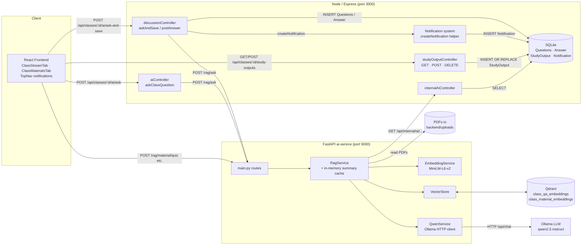
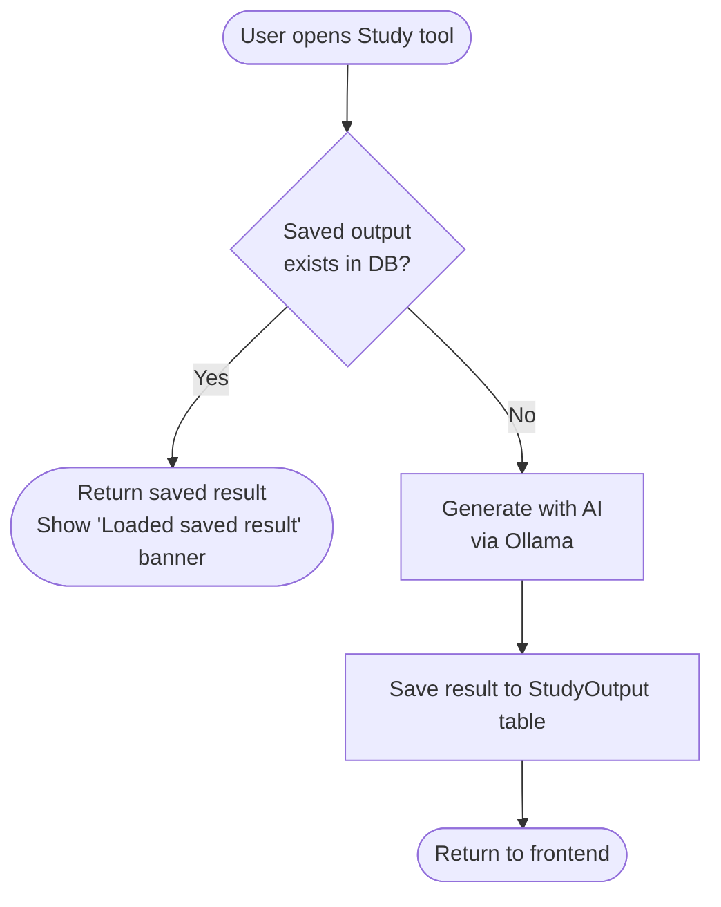
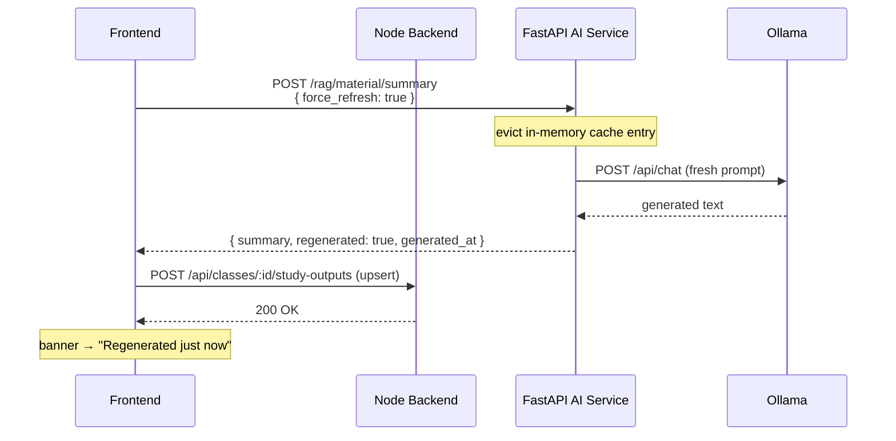
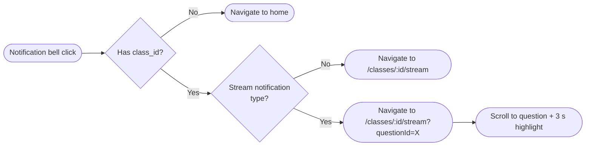

# Architecture

UniSystem's RAG subsystem is built from three deployable services plus two
backing data stores and a local LLM. Every component has a single
responsibility and communicates with its neighbours over HTTP.

---

## 1. Executive overview

The RAG subsystem turns a student's free-text question into one of three
outcomes:

| Outcome | When it happens |
| ------- | --------------- |
| **Answered from previous Q&A** | The question is semantically similar (cosine ≥ `QA_REUSE_THRESHOLD`, default `0.78`) to a question already answered by a doctor in the same class. |
| **Answered from material** | At least one material chunk scores above `0.50` (`MATERIAL_MATCH_THRESHOLD`) and the LLM produces a non-empty answer with confidence ≥ `0.6` (`ANSWER_CONFIDENCE_THRESHOLD`). |
| **Sent to doctor** | Neither source qualifies; the question is persisted and the doctor receives a notification. |

In addition, doctors and students can run **Study with AI** tools on a
material — summary, page-by-page summary, study notes, quiz, flashcards —
each of which feeds extracted chunks into the LLM with a strict prompt
schema. Generated outputs are **persisted to the database** so reopening
a tool loads instantly without re-calling the LLM, and a Regenerate button
forces fresh generation when needed.

Why it exists in UniSystem:

* **Reduce doctor workload** — common questions are auto-answered.
* **Knowledge re-use** — every doctor answer becomes future-searchable.
* **Self-service study** — students can generate quizzes and flashcards from
  any uploaded PDF.

Headline features (all real, all implemented):

* Previous Q&A retrieval against a per-class Qdrant collection.
* Material answering with chunk-level page citation.
* AI answer persistence — `Is_AI_Generated`, `Source_Type`, `Source_ID`,
  `Confidence`, `AI_Metadata` columns on the `Answer` table.
* Five Study-with-AI tools with strict per-option output validation.
* **Study-with-AI output persistence** — results saved per `(class_id,
  material_id, user_id, tool_type, options_key)` in `StudyOutput` table.
* **Regenerate flow** — `force_refresh=true` bypasses all caches and forces
  a fresh Ollama generation, replacing the saved output.
* **Class Stream (chat thread)** — persistent per-class Q&A history with
  threaded AI and doctor replies, class-scoped notifications, and deep-link
  scroll-to-question navigation.
* Markdown + KaTeX rendering on the frontend through a shared
  `MarkdownContent` component with an AI math sanitiser layer.
* Local Qwen2.5 LLM hosted by Ollama — no external API call.
* Qdrant vector database with two collections (QA + materials).

---

## 2. Layers

### 2.1 React frontend (`frontend/`)

* Vite + React 18 + TypeScript.
* Routing: `react-router-dom`.
* State: per-page `useState`, plus a Zustand auth store (`hooks/useAuthStore.ts`).
* HTTP: `frontend/src/services/apiClient.ts` — Axios instance with two
  base URLs:
  * `VITE_API_BASE_URL` (Node backend, default `http://localhost:3000/api`)
  * `VITE_AI_BASE_URL`  (FastAPI AI service, default `http://localhost:9000`)
* Markdown/KaTeX is rendered through
  [`frontend/src/components/MarkdownContent.tsx`](../../frontend/src/components/MarkdownContent.tsx)
  which uses `react-markdown` + `remark-gfm` + `remark-math` + `rehype-katex`,
  pre-processed by `aiMathSanitizer.ts`.
* Class Stream UI lives in
  [`frontend/src/pages/classes/ClassStreamTab.tsx`](../../frontend/src/pages/classes/ClassStreamTab.tsx).
* Study-with-AI modal lives in
  [`frontend/src/pages/classes/ClassMaterialsTab.tsx`](../../frontend/src/pages/classes/ClassMaterialsTab.tsx).

### 2.2 Node / Express backend (`backend/`)

* Express server boot file: [`backend/index.js`](../../backend/index.js)
* AI-related controllers:
  * [`backend/controllers/aiController.js`](../../backend/controllers/aiController.js)
    — class-scoped ask + general AI chat (mounted at
    `/api/classes/:classId/ai/ask` and `/api/classes/ai/ask`).
  * [`backend/controllers/discussionController.js`](../../backend/controllers/discussionController.js)
    — Class-Stream `getClassQuestions`, `postQuestion`, `postAnswer`,
    and `askAndSave` (the canonical RAG entry point that persists question +
    AI answer in one call).
  * [`backend/controllers/internalAiController.js`](../../backend/controllers/internalAiController.js)
    — internal-API endpoints called by the AI service to fetch class
    questions / materials. Protected by `INTERNAL_API_KEY`.
* The Node ↔ FastAPI bridge:
  [`backend/services/aiServiceClient.js`](../../backend/services/aiServiceClient.js).
* SQLite access goes through [`backend/utilities/database.js`](../../backend/utilities/database.js).
  Each model file (`backend/models/*.js`) issues a `CREATE TABLE IF NOT
  EXISTS` at boot.

### 2.3 FastAPI AI service (`ai-service/`)

* Entrypoint: [`ai-service/main.py`](../../ai-service/main.py) — declares
  Pydantic request models and one route per public endpoint.
* Core orchestration: [`ai-service/rag_service.py`](../../ai-service/rag_service.py)
  — class-level `RagService` that owns the embedding model, the vector
  store, the LLM wrapper and the backend client.
* LLM wrapper: [`ai-service/qwen_service.py`](../../ai-service/qwen_service.py)
  — POSTs chat completions to Ollama's `/api/chat`, plus prompt builders
  for every Study-with-AI tool.
* Embeddings: [`ai-service/embedding_service.py`](../../ai-service/embedding_service.py)
  — wraps `sentence-transformers` (default `all-MiniLM-L6-v2`,
  384-dimensional, cosine).
* Vector store: [`ai-service/vector_store.py`](../../ai-service/vector_store.py)
  — Qdrant client (in-memory or persistent local path).
* Backend client: [`ai-service/backend_client.py`](../../ai-service/backend_client.py)
  — calls the Node service's `/api/internal/ai/*` endpoints with the
  shared internal API key.
* Optional local LLM (currently superseded by Ollama):
  [`ai-service/local_llm.py`](../../ai-service/local_llm.py) — wraps
  `llama-cpp-python` to run Qwen GGUF locally without Ollama. The current
  `RagService` uses `QwenService` (Ollama) by default; `local_llm.py` is
  kept for offline/embedded use.

### 2.4 SQLite database (`backend/database.db`)

* Single-file SQLite. Tables that matter for RAG:
  * `Questions`    — persisted questions.
  * `Answer`       — persisted answers (human or AI).
  * `StudyOutput`  — cached Study-with-AI results, keyed by
    `(Class_ID, Material_ID, User_ID, Tool_Type, Options_Key)` with a
    `UNIQUE` constraint for upsert-style writes.
  * `Notification` — class-scoped push notifications (`doctor_question_pending`,
    `ai_answer_ready`, `doctor_answer_ready`) with `Class_ID`, `Reference_ID`
    (question), and `Answer_ID` columns for deep-link navigation.
  * `Class`, `Lecture`, `Material`, `User`, `Enrollment` — joined for
    access control and indexing.
* Schema and AI-specific columns are documented in
  [`database-and-vector-schema.md`](./database-and-vector-schema.md).

### 2.5 Qdrant vector store

* Two collections, both 384-dim cosine:
  * `class_qa_embeddings` — one point per indexed answered question.
  * `class_material_embeddings` — one point per material chunk.
* Storage modes:
  * `QDRANT_IN_MEMORY=true` (default) — non-persistent.
  * `QDRANT_IN_MEMORY=false` + `QDRANT_PATH` — local persistent storage
    (the running development setup uses `./qdrant_storage`).
* Class-scoped filtering: every search uses a `class_id` `MatchValue`
  filter so a search is always confined to one class.

### 2.6 Ollama LLM

* External process listening on `OLLAMA_URL` (default
  `http://localhost:11434`).
* Model is selected by `OLLAMA_MODEL`, falling back to `QWEN_MODEL` or
  `qwen2.5:7b-instruct`.
* Communication is straight HTTP — `POST /api/chat`, `stream=false`,
  options include `num_predict`, `temperature`, `top_p`, `repeat_penalty`.

### 2.7 Embedding model

* Default: `sentence-transformers/all-MiniLM-L6-v2` (384-dim, normalised).
* Loaded once per AI-service process at startup.
* Used both at index time (chunks/questions) and query time (the rewritten
  question).

---

## 3. System diagram



Legend:
* Solid arrows are HTTP calls.
* `(...)` boxes are storage.
* The "internal" arrows from `RagService` to the backend reuse the same
  HTTP transport but are gated by `verifyInternalApiKey` middleware.

---

## 4. Key design decisions

| Decision | Reason |
| -------- | ------ |
| Two Qdrant collections (Q&A vs. materials) | They have different payload shapes and very different score thresholds. Keeping them separate keeps each search fast and the threshold logic legible. |
| Cosine similarity, normalised vectors | MiniLM-L6-v2 vectors are ℓ2-normalised by default → cosine becomes a dot product → `score ∈ [-1, 1]` directly comparable across queries. |
| Strict JSON system prompt for quiz/flashcards | The 7-stage `parse_llm_json_output` repair pipeline still occasionally needs to recover truncated arrays; a hard system prompt minimises malformed output. |
| Backend `askAndSave` does both DB write *and* AI call | Lets the frontend insert the new question (with its AI answer) into the stream in one round-trip, with no race window where a question shows up answer-less. |
| Debounced auto re-index (8 s) | When a doctor posts several answers in a row (or the AI answers several questions), we coalesce them into one full-class re-index. |
| Internal API key between Node ↔ FastAPI | The AI service must read all class material text, including for classes the requesting user doesn't belong to (during indexing). Internal-only routes use a shared secret instead of user JWT. |
| KaTeX `throwOnError: false` + `aiMathSanitizer.ts` | LLMs occasionally emit invalid LaTeX. Sanitiser downgrades unbalanced or empty formulas to `code` spans rather than crashing the React tree. |
| `StudyOutput` UNIQUE constraint for upsert | A single `INSERT OR REPLACE` atomically handles both first-save and regenerate-replace without needing a separate UPDATE path or transaction guards. |
| `force_refresh` bypasses **both** cache layers | The in-memory summary cache and the DB persistence layer are independent. Regenerate must skip both or a cached in-memory summary would still be returned even though the DB row was replaced. |
| Duplicate-check on notifications | `doctor_question_pending`/`ai_answer_ready`/`doctor_answer_ready` are inserted with a `WHERE NOT EXISTS` guard so retried controller calls don't flood the notification inbox. |
| Options key sorted before hashing | `{a:1, b:2}` and `{b:2, a:1}` must produce the same DB row. Sorting option keys before joining ensures cache hits regardless of insertion order. |

---

## 5. Process & deployment topology

* **Local development**
  * Node backend: `node backend/index.js` (PORT=3000).
  * AI service:   `python ai-service/main.py` (PORT=9000).
  * Vite dev:     `npm run dev` in `frontend/` (PORT=5173).
  * Ollama:       runs as its own daemon (`ollama serve`).
* **Docker compose** (`docker-compose.yml`)
  * Three services: `backend`, `ai-service`, `frontend` (nginx).
  * Ollama is **not** in compose; the AI service expects Ollama at
    whatever URL `OLLAMA_URL` points to. The compose file in this repo
    sets `USE_LOCAL_MODEL=true` and `LOCAL_MODEL_*` envs as a fallback to
    use `local_llm.py` directly. **Current limitation:** `RagService`
    instantiates `QwenService` unconditionally, so to use the local-LLM
    path in a Compose deployment without Ollama you would need to swap
    the service binding manually.

---

## 6. Security boundary

| Boundary | Mechanism |
| -------- | --------- |
| Browser → Node backend | JWT in `Authorization: Bearer <token>`, verified by `middleware/verifytoken.js`. |
| Node backend → AI service | Plain HTTP (trusted network). No auth on `/rag/*` endpoints — any process that can reach port 9000 can call them. **Current limitation:** in production this should be locked down by network policy or by adding the same `INTERNAL_API_KEY` check to `/rag/*`. |
| AI service → Node backend | `x-internal-api-key` header, validated by `middleware/verifyInternalApiKey.js` with `crypto.timingSafeEqual`. |
| AI service → Ollama | Plain HTTP, localhost only. |
| AI service → Qdrant | In-process (embedded mode), no network. |

---

---

## 7. Study with AI — Persistence Layer

Generated Study-with-AI outputs are saved to the `StudyOutput` SQLite table
so that reopening a tool returns the saved result instantly — no LLM call,
no wait.

### 7.1 Storage key

Every row is uniquely identified by five dimensions:

| Column | Description |
| ------ | ----------- |
| `Class_ID` | The class the material belongs to. |
| `Material_ID` | The specific PDF/file. |
| `User_ID` | The student or doctor who generated the result. |
| `Tool_Type` | One of `summary`, `notes`, `pages`, `quiz`, `flashcards`. |
| `Options_Key` | Deterministic string built from sorted option key=value pairs, e.g. `summary::format=study_notes\|include_formulas=true\|length=medium`. |

A `UNIQUE` constraint on these five columns lets the backend do a
single `INSERT OR REPLACE` (upsert) on every save.

### 7.2 Open flow



### 7.3 Supported tools

All five Study-with-AI tools participate in persistence:

* **Summary** (`/rag/material/summary`) — markdown text
* **Study Notes** (`/rag/material/notes`) — markdown text
* **Page Summaries** (`/rag/material/page-summaries`) — array of `{ page, summary }`
* **Quiz** (`/rag/material/quiz`) — array of MCQ/T-F items
* **Flashcards** (`/rag/material/flashcards`) — array of `{ front, back, example }`

### 7.4 Lifetime

Saved outputs persist across browser refresh, logout, server restart, and
class reopening. They are replaced only when the user explicitly clicks
**Regenerate**.

---

## 8. Cache & Regenerate Strategy

### 8.1 Normal (cached) flow

A Study-with-AI request may be served from two layers of cache, checked in
order:

1. **DB persistence** (`StudyOutput` table) — checked by the frontend before
   it even calls the AI service. If a row exists for the current
   `(class, material, user, tool, options)` key the saved JSON is restored
   directly and the AI service is never contacted.
2. **In-memory summary cache** — `RagService.material_summary_cache` (Python
   dict keyed by `(class_id, material_id, length, format, include_formulas)`).
   Populated on the first Ollama call; reused for the same option combo
   within the same process lifetime.

### 8.2 Regenerate flow

Clicking **Regenerate** on the frontend:

1. Sets `regenerating=true` in component state — old content stays visible
   under an opacity overlay.
2. Calls `runGeneration(..., forceRefresh=true)` which passes
   `force_refresh: true` in every AI-service request body.
3. The AI service reads `force_refresh` from the Pydantic model and, for
   summary: evicts the in-memory cache entry, skips the payload-embedded
   summary shortcut, and runs Ollama generation unconditionally.
4. Fresh output is returned, the frontend calls
   `studyOutputService.save(...)` which issues an `INSERT OR REPLACE`,
   atomically replacing the previous saved row.
5. Banner updates to **"Regenerated just now"** (`wasRegenerated: true` in
   `cacheInfo` state).
6. If generation fails the previous result and banner are restored and an
   error toast appears for 5 s.



### 8.3 `updated_at` refresh

The `StudyOutput` table has an `Updated_At` column set on every upsert.
The frontend stores this timestamp in `cacheInfo.updatedAt` and displays it
in the banner: *"Generated May 7 at 02:30 PM"*.

---

## 9. Class Chat (Stream) Architecture

### 9.1 Overview

Each class has one persistent chat thread visible in the **Stream** tab.
Questions and replies survive page reload and are loaded from the `Questions`
and `Answer` tables on mount.

### 9.2 Message types

| Type | Who creates it | Where rendered |
| ---- | -------------- | -------------- |
| `student_question` | Student via text input | Top-level question bubble |
| `ai_answer` | `askAndSave` controller (auto) | Inline under parent question |
| `doctor_reply` | Doctor via reply form | Inline under parent question |
| `pending_doctor` | `askAndSave` when AI confidence is low | Inline badge under question |

### 9.3 RAG answer sources

When a student posts a question the `askAndSave` controller tries three
sources in priority order:

1. **Previous Q&A** — cosine ≥ `QA_REUSE_THRESHOLD` (0.78) against
   `class_qa_embeddings`.
2. **Material chunks** — score ≥ 0.50 against `class_material_embeddings`,
   LLM confidence ≥ 0.6.
3. **Send to doctor** — neither source qualifies; question is flagged
   `Is_AI_Generated = 0` and the doctor is notified.

### 9.4 UX features

* **Chronological thread** — questions sorted by creation time, replies
  nested underneath.
* **Sticky input bar** — always visible at the bottom of the stream.
* **Auto-scroll** — new messages scroll into view after posting.
* **Persistent history** — full question+answer history loads on mount.
* **Deep-link scroll** — clicking a notification navigates to
  `/classes/:id/stream?questionId=<id>` and the target question scrolls
  into view with a 3-second cyan highlight.

---

## 10. Notification Flow

### 10.1 Notification types

Three new class-scoped notification types were added alongside the existing
`new_material`, `new_grade`, etc.:

| Type | Recipient | Trigger |
| ---- | --------- | ------- |
| `doctor_question_pending` | Doctor | AI confidence too low; question escalated |
| `ai_answer_ready` | Student | AI successfully answered their question |
| `doctor_answer_ready` | Student | Doctor posted a reply to their question |

### 10.2 Metadata stored per notification

| Column | Purpose |
| ------ | ------- |
| `Class_ID` | Scopes the notification to one class |
| `Reference_ID` | `Question_ID` of the relevant question |
| `Answer_ID` | `Answer_ID` for doctor/AI reply (nullable) |
| `Type` | One of the three types above |

A duplicate-check query (`WHERE User_ID=? AND Type=? AND Class_ID IS ? AND
Reference_ID IS ? AND Answer_ID IS ?`) prevents re-sending the same
notification if a controller retries.

### 10.3 Navigation flow



Notification types `doctor_question_pending`, `ai_answer_ready`, and
`doctor_answer_ready` all carry a `reference_id` (question ID) and trigger
the deep-link path.

---

## 11. Rendering & Math Pipeline

### 11.1 Shared renderer

All AI-generated text — stream answers, Study-with-AI results — is rendered
through [`frontend/src/components/MarkdownContent.tsx`](../../frontend/src/components/MarkdownContent.tsx).

The rendering stack is:

```
raw AI text
    │
    ▼  aiMathSanitizer.ts  (normalizeAIOutputForDisplay)
cleaned text
    │
    ▼  react-markdown
    │  + remark-gfm      (tables, strikethrough, task lists)
    │  + remark-math     (detect $…$ and $$…$$ delimiters)
    │  + rehype-katex    (render math to HTML, throwOnError: false)
    ▼
rendered React tree
```

### 11.2 AI math sanitiser (`aiMathSanitizer.ts`)

The sanitiser runs before ReactMarkdown and handles the most common LLM
math issues:

| Stage | What it does |
| ----- | ------------ |
| Unmatched `$` removal | Strips lone dollar signs that would confuse the math parser |
| Unicode substitution | Replaces 40+ LaTeX commands (`\alpha`, `\frac{}{}` simple cases, etc.) with their Unicode equivalents — no KaTeX needed |
| Complex formula fallback | Wraps multi-level `\frac`, `\sum`, `\int` patterns that can't be safely simplified in `*(see notes for formula)*` |
| `normalizeFlashcardText` | Extra pipeline for flashcard front/back text: prefers plain English over any LaTeX to keep cards readable on mobile |

### 11.3 KaTeX error handling

`rehype-katex` is configured with `throwOnError: false` so malformed
formulas never crash the React tree. The CSS override in `index.css`
re-styles KaTeX error spans as neutral monospace code spans instead of
the default harsh red, keeping student-facing content clean even when
the LLM emits slightly broken LaTeX.

---

Continue with [`end-to-end-flow.md`](./end-to-end-flow.md) for the request
walk-through.
