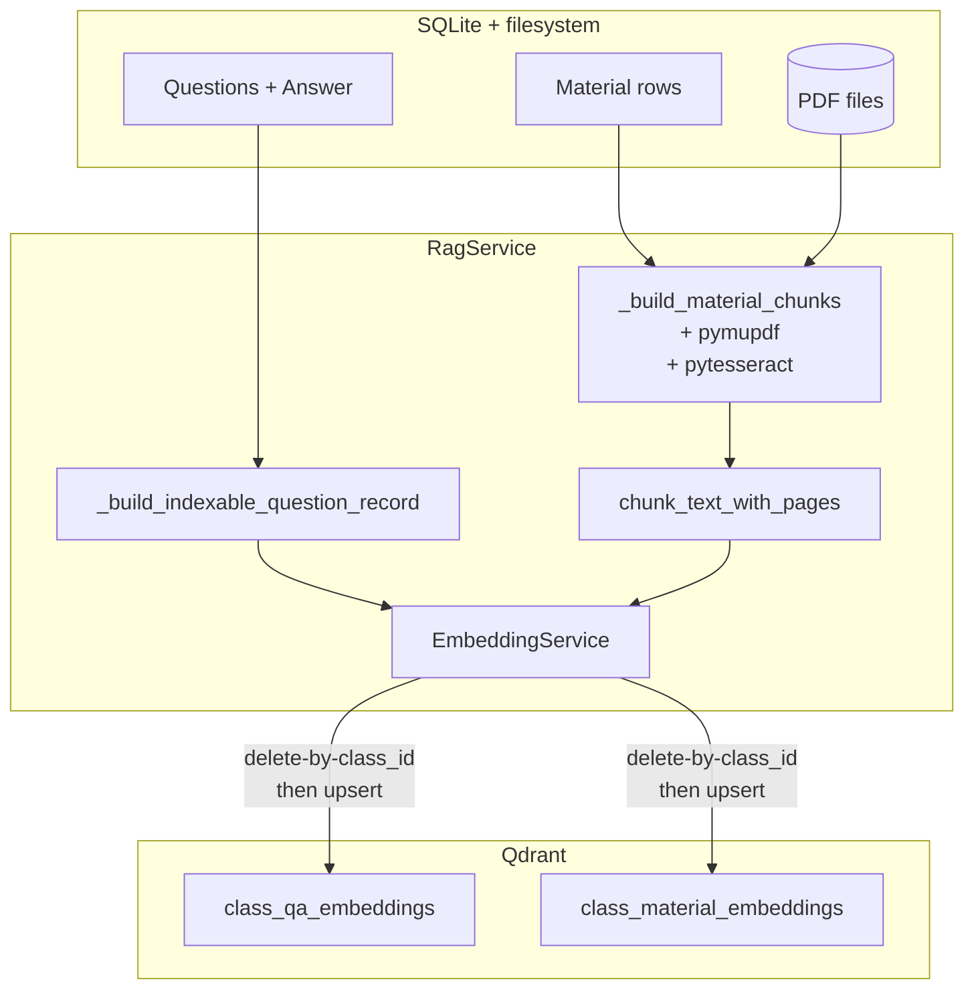

# Database and Vector Schema

The RAG subsystem persists data in two places:

* **SQLite** (`backend/database.db`) — relational source of truth for
  questions, answers, materials, and AI metadata.
* **Qdrant** — vector index over questions and material chunks; rebuilt
  from SQLite at every re-index.

---

## 1. SQLite tables

### 1.1 `Questions`

Defined in [`backend/models/questionModel.js`](../../backend/models/questionModel.js).

```sql
CREATE TABLE IF NOT EXISTS Questions (
  Questions_ID INTEGER PRIMARY KEY AUTOINCREMENT,
  Text         TEXT NOT NULL,
  User_ID      INTEGER,
  Class_ID     INTEGER NOT NULL,
  Doctor_ID    INTEGER,
  FOREIGN KEY (User_ID)   REFERENCES Student(User_ID) ON DELETE CASCADE,
  FOREIGN KEY (Class_ID)  REFERENCES Class(Class_ID)  ON DELETE CASCADE,
  FOREIGN KEY (Doctor_ID) REFERENCES Doctor(User_ID)  ON DELETE SET NULL
);
```

Notes:
* `User_ID` is set when a student asks; `Doctor_ID` when a doctor asks.
  Exactly one of the two is populated per row.
* The Class Stream UI relies on `q.rowid AS Time` as a stable monotonic
  ordering proxy (the table itself does not store a creation timestamp).

### 1.2 `Answer`

Defined in [`backend/models/answerModel.js`](../../backend/models/answerModel.js).

```sql
CREATE TABLE IF NOT EXISTS Answer (
  Answer_ID    INTEGER NOT NULL,
  Questions_ID INTEGER NOT NULL,
  Text         TEXT    NOT NULL,
  Time         DATETIME DEFAULT CURRENT_TIMESTAMP,
  Doctor_ID    INTEGER,
  User_ID      INTEGER,
  PRIMARY KEY (Answer_ID, Questions_ID),
  FOREIGN KEY (Questions_ID) REFERENCES Questions(Questions_ID) ON DELETE CASCADE,
  FOREIGN KEY (Doctor_ID)    REFERENCES Doctor(User_ID)         ON DELETE SET NULL,
  FOREIGN KEY (User_ID)      REFERENCES Student(User_ID)        ON DELETE SET NULL
);
```

* `Answer_ID` is computed by the controller as `MAX(Answer_ID) + 1` per
  question, not auto-incremented. This is why the primary key is
  composite.
* For AI answers, both `Doctor_ID` and `User_ID` are `NULL`.

### 1.3 AI metadata columns on `Answer`

The discussion controller writes the following extra columns on AI
answers:

| Column | Type | Set by | Meaning |
| ------ | ---- | ------ | ------- |
| `Is_AI_Generated` | INTEGER (0/1) | `askAndSave` (constant `1`) | Marks the row as machine-generated; both `User_ID` and `Doctor_ID` are NULL when this is `1`. |
| `Source_Type`     | TEXT          | `ragResult.source_type` (`previous_qa` / `material`) | Drives the colour and badge rendered in `AiAnswerBubble`. |
| `Source_ID`       | TEXT          | `ragResult.source_id` (or `previous_answer.answer_id`) | The original question_id (for `previous_qa`) or the material_id (for `material`). Stored as TEXT to keep ID type-uniform. |
| `Confidence`      | REAL          | `ragResult.confidence` (0–1) | Used to render the `% match` chip. |
| `AI_Metadata`     | TEXT          | `JSON.stringify({...})` | Full sidecar JSON: `source_type`, `confidence`, `previous_question`, `previous_answer`, `material_name`, `page`. |

> **Current limitation — schema drift.** These five columns are read and
> written by `discussionController.js` and the frontend, but they are
> **not** declared in `answerModel.js` or in `migrate.js`. They were
> added to the running SQLite file by an out-of-band `ALTER TABLE` and
> exist in the development database. A fresh deployment that runs only
> the model files will not have these columns. The recommended fix is
> to add the following to `migrate.js`:
>
> ```js
> db.run("ALTER TABLE Answer ADD COLUMN Is_AI_Generated INTEGER DEFAULT 0", (e)=>console.log(e?.message||"Is_AI_Generated"));
> db.run("ALTER TABLE Answer ADD COLUMN Source_Type     TEXT",                (e)=>console.log(e?.message||"Source_Type"));
> db.run("ALTER TABLE Answer ADD COLUMN Source_ID       TEXT",                (e)=>console.log(e?.message||"Source_ID"));
> db.run("ALTER TABLE Answer ADD COLUMN Confidence      REAL",                (e)=>console.log(e?.message||"Confidence"));
> db.run("ALTER TABLE Answer ADD COLUMN AI_Metadata     TEXT",                (e)=>console.log(e?.message||"AI_Metadata"));
> ```

### 1.4 How AI answers reach the UI on refresh

`GET /api/classes/:classId/questions` (`getClassQuestions`) selects from
`Answer JOIN User`, projecting the AI columns. When `Is_AI_Generated =
1`, the controller:

* substitutes `'AI Assistant'` for `User_Name`;
* substitutes `'ai'` for `User_Role`;

so that even after a hard reload the stream renders the lavender AI
bubble identically to the freshly-inserted version. `AI_Metadata` is
parsed by `mapRawAnswer` on the client and feeds the source badge,
asker/answerer names (for `previous_qa`) and page citation (for
`material`).

### 1.5 Other tables touched during indexing

| Table | Why the AI service needs it |
| ----- | --------------------------- |
| `Class`       | `Doctor_ID` for notification routing; access checks. |
| `Lecture`     | Joined with `Material` to associate a material with its `Class_ID`. |
| `Material`    | `Document` path / `URL` resolution + display name. |
| `User`        | Names + roles for asker / answerer metadata. |
| `Enrollment`  | Access checks for non-doctor users. |
| `Notification`| `createNotification` writes a `new_question` row when a question is escalated. |

The AI service never writes to SQLite. All persistence in the database
goes through Express controllers.

---

## 2. Qdrant collections

The collections are created on AI-service startup by
[`vector_store.py`](../../ai-service/vector_store.py) with cosine
distance and a vector size that matches the active embedding model
(`EMBEDDING_MODEL`, default `all-MiniLM-L6-v2` → 384).

### 2.1 `class_qa_embeddings`

| Aspect | Value |
| ------ | ----- |
| Vector | embedding of `question_text` |
| Dim    | 384 (cosine) |
| Point ID | `uuid5(NAMESPACE_URL, "qa:<question_id>")` (deterministic per question) |

Payload (`_qa_payload`):

| Field | Source | Notes |
| ----- | ------ | ----- |
| `class_id`         | int  | Used by every search filter. |
| `question_id`      | int  | The original `Questions.Questions_ID`. |
| `answer_id`        | int? | First doctor answer's ID (or first answer if no doctor answer). |
| `question_text`    | text | Verbatim question; what we embedded. |
| `answer_text`      | text | The text that will be returned when this point matches. Required — questions without an `answer_text` are skipped during indexing. |
| `asked_by_id`      | str  | User_ID stringified (allows future user-uuid migrations). |
| `asked_by_name`    | str  | "F_Name L_Name" or empty. |
| `asked_by_role`    | str  | `"student"` or `"doctor"`. |
| `asked_at`         | str  | ISO timestamp; uses `q.Time` if present. |
| `answered_by_id`   | str  | User_ID of the doctor (or student) who answered. |
| `answered_by_name` | str  | Name string. |
| `answered_by_role` | str  | `"doctor"` (default) or `"student"`. |
| `answered_at`      | str  | ISO timestamp from `Answer.Time`. |

When a class is fully re-indexed (`bulk_replace_questions`), every
existing point with the same `class_id` is deleted before the new
batch is upserted.

### 2.2 `class_material_embeddings`

| Aspect | Value |
| ------ | ----- |
| Vector | embedding of the chunk's text |
| Dim    | 384 (cosine) |
| Point ID | One of two deterministic UUIDs depending on path: `uuid5(NAMESPACE_URL, "class-material:<class_id>:<material_id>:<index>")` for full-class re-index, or `uuid5(NAMESPACE_URL, "material:<material_id>:<index>")` for a single-material re-index. |

Payload (`bulk_replace_materials` / `replace_material_chunks`):

| Field | Source | Notes |
| ----- | ------ | ----- |
| `class_id`        | int  | Filter key. |
| `material_id`     | int  | Surfaces in `source_id` of the answer response. |
| `material_name`   | str  | From `Material.Name` (falls back to `"Class Material"`). |
| `material_type`   | str  | `"file"`, `"link"`, or extension (e.g. `"pdf"`). |
| `text`            | str  | Same as `chunk_text`; kept for backward compat. |
| `chunk_text`      | str  | The text that was embedded. |
| `summary`         | str  | Per-chunk LLM summary, **only if** `ENABLE_MATERIAL_SUMMARY=true`. |
| `material_summary`| str  | Whole-material LLM summary, same gate. Both default to `""`. |
| `chunk_index`     | int  | Stable order across pages. |
| `source_type`     | str  | Hard-coded `"material"`. |
| `text_source_field` | str | Provenance: `"pdf_extracted_text"`, `"pdf_ocr_text"`, or one of `"document"`, `"content"`, `"name"`, etc. when no PDF was detected. |
| `source_name`     | str  | Same as `material_name`; included so client renderers don't have to special-case which field to read. |
| `page_number`     | int? | 1-based page number, or `null` if the source wasn't a PDF. |

> **Current limitation — `summary` / `material_summary`.** These are
> populated only when `ENABLE_MATERIAL_SUMMARY=true`. Leaving the gate
> off means `RagService.summarize_material_content` cannot use a
> payload-cached summary fast-path on `mode="simple"` and instead has to
> rebuild from raw chunks every time. The dev environment has the gate
> off (an extra Ollama call per chunk is expensive). Set the env var to
> `true` and re-index a class to populate the field.

> **Score / confidence is NOT stored in payload.** Cosine score is
> computed at query time only and never persisted to Qdrant. The
> `Confidence` value written to SQLite is a *derived* number:
> `(top_material_score + llm_self_confidence) / 2` for material
> answers, or the raw QA cosine score for previous-Q&A reuse.

---

## 3. Index lifecycle



Triggers (recap from [`end-to-end-flow.md`](./end-to-end-flow.md)):

* Class re-index: explicit user click (Doctor/Admin only).
* Question re-index: every doctor answer; every successful AI answer.
* Material re-index: lazy auto-recovery on Study-with-AI calls; the
  internal endpoint exists for future material-upload hooks.

---

## 4. Quick reference — what ends up where

| Information | Lives in |
| ----------- | -------- |
| Question text | `Questions.Text` (SQLite) + payload of `class_qa_embeddings` |
| Doctor / human answer text | `Answer.Text` (SQLite) + payload of `class_qa_embeddings` |
| AI answer text | `Answer.Text` (SQLite) only — **not** indexed in Qdrant |
| Material PDF binary | `backend/uploads/<filename>.pdf` |
| Extracted material text | embedded into Qdrant; not persisted to SQLite |
| Per-class confidence threshold | env var `QA_REUSE_THRESHOLD` (in-memory) |
| Summaries cache | in-process dict `RagService.material_summary_cache` (lost on restart) |

> **AI answers are intentionally not indexed.** Re-using an AI answer to
> answer a future question would compound any LLM hallucination — only
> doctor-validated Q&A pairs make it back into the retrieval corpus.

For environment variables that govern these defaults, see
[`debugging-guide.md`](./debugging-guide.md#environment-variables).
