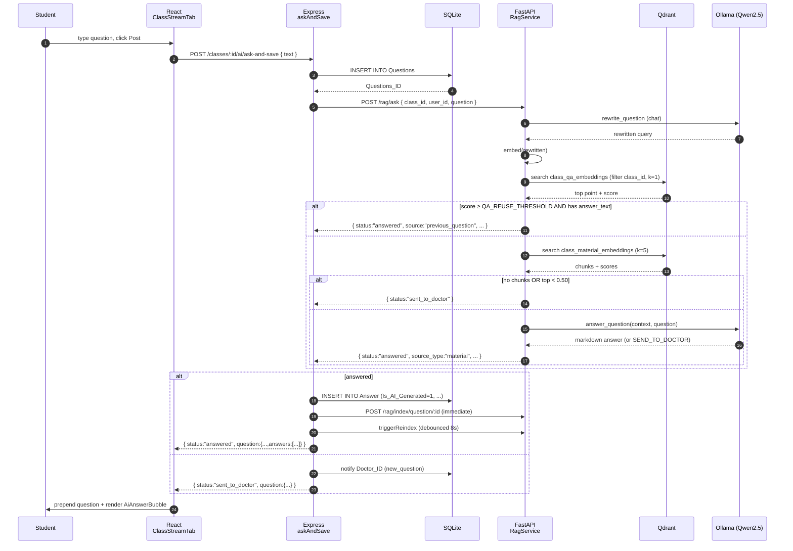
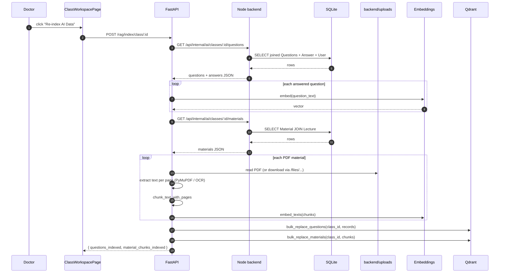

# End-to-End Flow

This document walks the entire life-cycle of a class question, from the
moment a student types it into the Class Stream until the answer is
rendered, persisted, and indexed for future reuse. It also covers the
indexing flow used by the **Re-index AI Data** button and by automatic
triggers, and the per-tool flows for Study with AI.

---

## 1. Ask flow — the canonical path

The frontend calls **one** backend endpoint:
`POST /api/classes/:classId/ai/ask-and-save`. That endpoint is
implemented by `askAndSave` in
[`backend/controllers/discussionController.js`](../../backend/controllers/discussionController.js).

### 1.1 Step-by-step

| # | Actor | Action |
| - | ----- | ------ |
| 1 | Student | Types text into the new-post box in `ClassStreamTab.tsx` and clicks Post (or Ctrl/Cmd-Enter). |
| 2 | Frontend | `realClassService.askAndSave(classId, text)` issues `POST /api/classes/:classId/ai/ask-and-save` with `{ text }`. |
| 3 | Backend  | `askAndSave` validates input, then runs `INSERT INTO Questions (...)` to persist the question. The new `Questions_ID` is captured. |
| 4 | Backend  | `aiServiceClient.askQuestion({ class_id, user_id, question })` posts to the AI service `POST /rag/ask`. |
| 5 | AI svc   | `RagService.ask_question` calls `QwenService.rewrite_question` to turn the raw question into a tighter search query (preserving symbols and variable names). |
| 6 | AI svc   | `EmbeddingService.embed_text` generates a 384-dim vector for the rewritten query. |
| 7 | AI svc   | `VectorStore.search_questions` runs a cosine search over `class_qa_embeddings` filtered by `class_id`, with `limit=1`. |
| 8 | AI svc   | If best score `≥ QA_REUSE_THRESHOLD` (default `0.78`) **and** the matched payload has `answer_text` — return immediately with `source: "previous_question"`, `source_type: "previous_qa"`, plus the original asker / answerer metadata. |
| 9 | AI svc   | Otherwise: `VectorStore.search_materials` runs a cosine search over `class_material_embeddings` (limit=`MATERIAL_CONTEXT_LIMIT` = 5). |
| 10| AI svc   | If no chunks found OR the top score `< MATERIAL_MATCH_THRESHOLD` (`0.50`) → return `{ status: "sent_to_doctor" }`. |
| 11| AI svc   | Smart chunk pruning: keep chunks within 15 % of the top score (always at least 2, never more than 5). |
| 12| AI svc   | `QwenService.answer_question` builds a context block from the surviving chunks, calls Ollama. The system prompt forbids hallucination, mandates KaTeX delimiters and (if context contains page numbers) appends `(Source: page N)`. |
| 13| AI svc   | If the LLM returns the literal `SEND_TO_DOCTOR`, or confidence `< ANSWER_CONFIDENCE_THRESHOLD` (`0.6`), return `sent_to_doctor`. Otherwise return `{ status: "answered", source_type: "material", source_id, page, highlight, confidence, answer }`. |
| 14| Backend  | If `status === "answered"`, compute next `Answer_ID = max + 1`, then `INSERT INTO Answer (..., Is_AI_Generated=1, Source_Type, Source_ID, Confidence, AI_Metadata)`. `AI_Metadata` is a JSON blob containing `source_type`, `confidence`, `previous_question`, `previous_answer`, `material_name`, `page`. |
| 15| Backend  | Fire `aiServiceClient.indexQuestion(questionId)` so the new Q&A pair becomes searchable on its own, then `triggerReindex(classId, 'ai_answer')` to schedule a debounced full-class re-index (8 s). |
| 16| Backend  | Build the response question object including the freshly-built `answers: [...]` array and return `{ status: 'answered', question: {...} }`. |
| 17| Backend  | If `status === "sent_to_doctor"` instead, persist the question only, send a `new_question` notification to `class.Doctor_ID`, and return the same wrapper with `status: 'sent_to_doctor'`. |
| 18| Frontend | `handlePost` prepends the returned question to the `questions` state and auto-expands its `answers` panel if it has any. |
| 19| Frontend | `AiAnswerBubble` renders the answer with `MarkdownContent`, plus a source badge (Previous Q&A vs. From material) and a `% match` chip from `confidence`. |

### 1.2 Sequence diagram



### 1.3 Failure paths

| Fault | Behaviour |
| ----- | --------- |
| AI service unreachable | `aiServiceClient.askQuestion` raises; `askAndSave` catches with `console.error` and falls through to the `sent_to_doctor` path (status returned to FE is the literal `'fallback'`). |
| Ollama unreachable | `_call_ollama` returns `None` → `answer_question` returns `decision: sent_to_doctor` → backend escalates. |
| Qdrant empty for class | `search_questions` returns `[]` → fall through to material search; if that's empty too → `sent_to_doctor`. |
| LLM returns invalid JSON (Study with AI) | `parse_llm_json_output` runs the 7-stage repair pipeline; if all stages fail the AI service returns `{ status: "error", message: "Failed to parse LLM JSON output", raw_output }`. |

---

## 2. Indexing flow

Indexing is what makes Q&A and material chunks searchable. There are
three levels of granularity, all backed by the same payload schemas
(see [`database-and-vector-schema.md`](./database-and-vector-schema.md)).

### 2.1 Triggers

| Trigger | Endpoint hit | Effect |
| ------- | ------------ | ------ |
| Doctor / admin clicks **Re-index AI Data** in `ClassWorkspacePage.tsx`. | `POST /rag/index/class/:classId` (called directly from the browser to the AI service URL). | Full class re-index — all questions and all materials. |
| Doctor posts an answer (`postAnswer` in `discussionController.js`). | `POST /rag/index/question/:questionId` then `triggerReindex(classId, 'doctor_answer')` (debounced full-class). | Single Q&A pair is indexed immediately; full class re-index fires 8 s later. |
| AI answers a class question via `askAndSave`. | Same: `indexQuestion` immediately + debounced `triggerReindex`. | Same. |
| Material upload (handled by the material controller). | **Current limitation:** the codebase contains an `indexMaterialInAI` controller and route (`POST /api/internal/ai/materials/:materialId/index/:classId`) but the material-upload controller does not wire it into the upload flow. Materials are indexed lazily via the `withAutoIndex` retry on the frontend (see §2.4). |

### 2.2 Class re-index (`POST /rag/index/class/:classId`)

`RagService.index_class` performs:

1. `BackendClient.get_class_questions(class_id)` — calls
   `GET /api/internal/ai/classes/:classId/questions` on the Node backend
   (auth via `INTERNAL_API_KEY`). Each question comes with all of its
   answers ordered with doctor answers first.
2. For every question with at least one answer, build an indexable record
   via `_build_indexable_question_record`. The first doctor answer wins;
   if none exists, the first answer wins.
3. Embed the question text with `EmbeddingService.embed_text`.
4. `BackendClient.get_class_materials(class_id)` — fetches all materials
   for the class.
5. For each material, call `_build_material_chunks`:
   * Detect PDF (by `type == "pdf"` or `.pdf` suffix).
   * Resolve the file: absolute path → repo-relative → `backend/uploads/`
     → otherwise treat as a remote URL (`/files/...` is rebased onto
     `PDF_BASE_URL`, anything else onto `BACKEND_API_URL`).
   * Extract per-page text with `pymupdf`. If a page yields fewer than 60
     chars and `ENABLE_OCR=true`, fall back to Tesseract OCR at 200 DPI.
   * Chunk each page's text with `chunk_text_with_pages` (sliding window,
     `PDF_CHUNK_SIZE=900`, `PDF_CHUNK_OVERLAP=150`, snapping to word
     boundaries when the boundary is past the half-way point).
   * Embed all chunks in batch.
   * **Current limitation:** `ENABLE_MATERIAL_SUMMARY` defaults to `false`;
     when off, both `chunk.summary` and `chunk.material_summary` are stored
     as empty strings. Turning it on issues an extra Ollama call per chunk
     and per material — expensive.
6. `VectorStore.bulk_replace_questions(class_id, ...)` — deletes every
   point in `class_qa_embeddings` matching the class, then upserts the
   new ones.
7. `VectorStore.bulk_replace_materials(class_id, ...)` — same for
   `class_material_embeddings`.

### 2.3 Single-record indexing

* `POST /rag/index/question/:question_id` →
  `RagService.index_question` → fetch one question via
  `BackendClient.get_question`, build a record (skipping if no answer
  text), embed, then `VectorStore.replace_question` (delete-by-`question_id`
  + upsert).
* `POST /rag/index/material/:material_id` →
  `RagService.index_material` → fetch one material, build chunks, then
  `VectorStore.replace_material_chunks` (delete-by-`material_id` +
  upsert).

### 2.4 Lazy material indexing

When the frontend calls a Study-with-AI endpoint (`/rag/material/quiz`,
etc.), the helper `withAutoIndex` in
[`frontend/src/services/realServices.ts`](../../frontend/src/services/realServices.ts)
inspects the response. If it's `{ status: "error", message: "Material not
indexed" }`, the helper triggers
`POST /rag/index/material/:material_id` and re-runs the original
request. This means a material can be uploaded and used for Study with
AI without an explicit re-index — but the **first** call after upload
incurs the indexing latency.

### 2.5 Sequence diagram — class re-index



### 2.6 Persistence

* When `QDRANT_IN_MEMORY=false`, Qdrant data lives at `QDRANT_PATH`
  (default `./qdrant_storage`). The directory at
  `ai-service/qdrant_storage/` is the live store in development.
* On every re-index, **all points in scope are deleted first** before
  upserting — there is no incremental partial update. This means a
  re-index after a payload-schema change cleanly removes stale fields.
* **Current limitation:** there is no migration tool. If you add a new
  payload field to `vector_store.py`, an old persistent store will
  return points lacking that field. The fix is to run a full class
  re-index for every class.

---

## 3. Retrieval decision logic

```mermaid
flowchart TD
  Q[Question text] --> R[Rewrite via LLM]
  R --> E[Embed]
  E --> SQA[Search class_qa_embeddings k=1]
  SQA --> CMP{score ≥ 0.78<br/>AND answer_text ≠ ""}
  CMP -- yes --> RetQA[Return previous_qa]
  CMP -- no --> SMAT[Search class_material_embeddings k=5]
  SMAT --> EMP{any results AND top ≥ 0.50}
  EMP -- no --> Doc[Return sent_to_doctor]
  EMP -- yes --> PR[Prune chunks within<br/>15% of top score, min 2]
  PR --> ANS[QwenService.answer_question]
  ANS --> DEC{decision == answered<br/>AND confidence ≥ 0.6<br/>AND answer non-empty}
  DEC -- no --> Doc
  DEC -- yes --> CONF[combined_confidence =<br/>(top_score + llm_confidence) / 2]
  CONF --> RetMat[Return source_type=material<br/>+ page + highlight]
```

### 3.1 Source types in the response

`RagService.ask_question` returns one of:

| `status` | Other fields | Meaning |
| -------- | ------------ | ------- |
| `answered` + `source: "previous_question"` + `source_type: "previous_qa"` | `previous_question`, `previous_answer`, `confidence` | Reused an existing doctor answer. |
| `answered` + `source_type: "material"` | `source_id` = material_id, `page`, `highlight`, `confidence` | Generated a new answer from material chunks. |
| `sent_to_doctor` | _(none)_ | Backend will persist the question only and notify the doctor. |

### 3.2 No-answer behaviour

Whenever the AI service returns `sent_to_doctor`, the backend's
`askAndSave`:

1. Persists the question (already done at the start).
2. Looks up `Class.Doctor_ID`.
3. Calls `createNotification` with type `new_question`.
4. Returns `status: 'sent_to_doctor'` (or `'fallback'` if the AI service
   itself raised) plus the question object with empty `answers`.

The frontend prepends the question without an AI bubble; the doctor sees
a notification and replies via the regular reply UI, which calls
`POST /api/questions/:questionId/answers` (`postAnswer`). On a doctor
answer, the same indexing trigger fires and the Q&A is reusable from
that moment.

---

## 4. Study-with-AI flow

All Study-with-AI tools share the same UX shell (a 3-step modal: tool
selection → options → result) implemented in
[`frontend/src/pages/classes/ClassMaterialsTab.tsx`](../../frontend/src/pages/classes/ClassMaterialsTab.tsx).

For each tool, the frontend assembles option keys (snake_case, matching
the AI Pydantic model exactly) and calls one of the `aiRagService`
helpers; those helpers POST directly to the AI service through
`AI_BASE_URL`, wrapped in `withAutoIndex` so a missing index is
self-healing.

| Tool | Frontend service | AI endpoint | Strict options |
| ---- | ---------------- | ----------- | -------------- |
| Summarize material | `aiRagService.summarizeMaterial` | `POST /rag/material/summary` | `length` ∈ `{short,medium,detailed}`, `format` ∈ `{paragraph,bullet_points,study_notes}`, `include_formulas` |
| Page-by-Page summary | `aiRagService.getPageSummaries` | `POST /rag/material/page-summaries` | `detail_level` ∈ `{brief,normal,detailed}`, `include_key_terms`, `include_formulas` |
| Study notes | `aiRagService.getNotes` | `POST /rag/material/notes` | `notes_style` ∈ `{cornell,bullet_notes,exam_revision}`, `detail_level` ∈ `{normal,detailed,very_detailed}`, `include_examples`, `include_formulas` |
| Quiz | `aiRagService.getQuiz` | `POST /rag/material/quiz` | `count` (clamped 1-20), `difficulty` ∈ `{easy,medium,hard,mixed}`, `question_type` ∈ `{mcq,true_false,mixed}` |
| Flashcards | `aiRagService.getFlashcards` | `POST /rag/material/flashcards` | `count` (clamped 1-30), `focus` ∈ `{key_terms,definitions,formulas,mixed}`, `include_examples` |

### 4.1 Per-tool prompt behaviour and validation

* **Summary** — three strict instruction blocks (`LENGTH`, `FORMAT`,
  `FORMULA`) injected into a single prompt; `summarize_material_content`
  caches per `(class_id, material_id, length, format, include_formulas)`
  in-memory. Output is plain Markdown (with KaTeX-formatted math when
  `include_formulas`).
* **Page summaries** — iterates per-page chunks; one Ollama call per
  page; aggregated into `[{page, summary}, ...]`.
* **Notes** — single LLM call; `notes_style` selects between Cornell,
  bullet, or exam-revision templates; output is structured Markdown.
* **Quiz** — single LLM call with `_JSON_SYSTEM_PROMPT`; the result is
  parsed via `parse_llm_json_output`, then `_sanitize_quiz_items`
  enforces option count per type, normalises the `answer` to a single
  letter, and fills a fallback explanation if the LLM omitted one. After
  sanitisation, `_validate_quiz` checks per-question count and the
  mixed-type ratio (≥40 % each); on failure the service retries once
  with an additional retry hint.
* **Flashcards** — same JSON path; `_sanitize_flashcards` accepts both
  legacy `{term,definition}` and current `{front,back,example,focus_type}`
  shapes; LaTeX inside each field is validated by
  `_validate_and_log_flashcard_latex` (brace balance, `\frac` arity,
  unmatched `$`); `_validate_flashcards` enforces card count, focus_type
  and (for `focus=formulas`) the presence of LaTeX in the `back` field.

### 4.2 Markdown / KaTeX rendering

Every answer/summary/note returned by the service is rendered through
`MarkdownContent`, which:

1. Pre-sanitises with `sanitizeAiMarkdown` (converts environments and
   `\[...\]` / `\(...\)` to `$$...$$` / `$...$`, fixes OCR artifacts in
   non-math regions, downgrades unbalanced/empty formulas to `<code>`).
2. Pipes through `react-markdown` with `remark-gfm`, `remark-math`, and
   `rehype-katex` (the latter with `throwOnError: false`).

### 4.3 Export

The Study-with-AI result modal includes an **Export** dropdown
(`ExportMenu` in `ClassMaterialsTab.tsx`) with three options:

* **PDF** — uses `html2pdf.js` to capture a serialised HTML version of
  the result built by `_buildBodyContent` in
  [`frontend/src/utils/exportStudyContent.ts`](../../frontend/src/utils/exportStudyContent.ts).
* **Markdown (.md)** — direct serialisation via `toMarkdown`.
* **Text (.txt)** — `toPlainText` strips Markdown syntax for a flat
  preview.

PDF export builds its own styled HTML rather than capturing the live
React DOM, so KaTeX formulas are emitted as their raw `$...$` source in
the PDF (this is intentional: the live DOM is inside an `overflow-y-auto`
modal which html2canvas cannot capture cleanly).

---

Continue with [`api-reference.md`](./api-reference.md) for the exact HTTP
contracts and example payloads.
